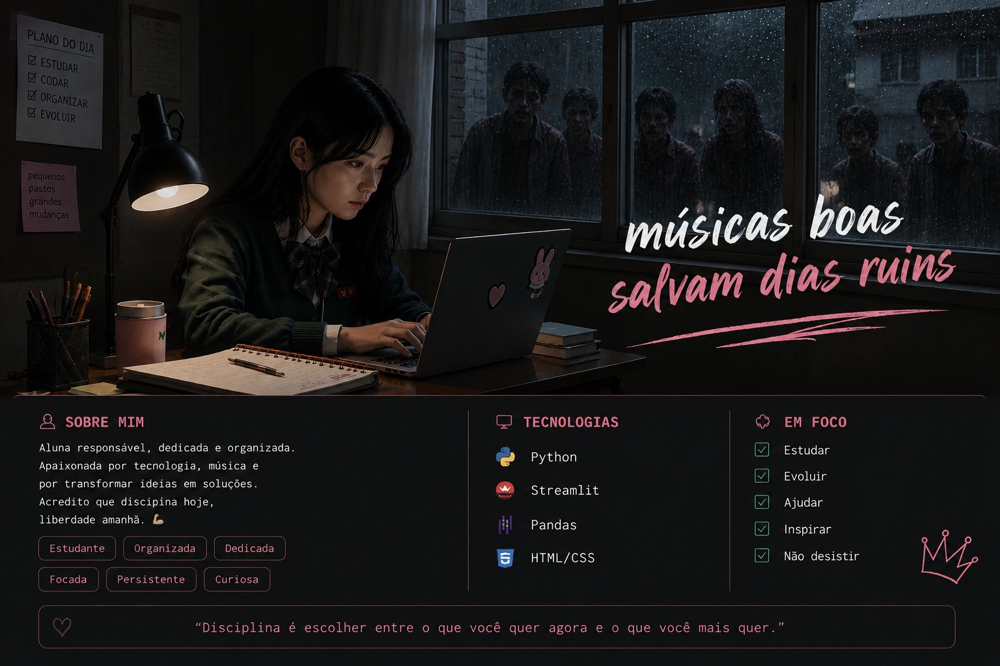

## Hi there 👋

# 🎧 Meu Projeto de Música

> ✨ músicas boas salvam dias ruins

## 💻 Sobre mim

Sou uma aluna responsável, dedicada e organizada, apaixonada por tecnologia e música.  
Gosto de transformar ideias em projetos e aprender algo novo a cada etapa.

## 🎵 Sobre o projeto

Este projeto foi desenvolvido em Python com Streamlit para organizar músicas por gênero e criar uma experiência simples e agradável para encontrar músicas.

## 🛠️ Tecnologias

- 🐍 Python
- 🎨 Streamlit
- 📊 Pandas
- 💻 HTML/CSS

## 🌷 Em foco

- ✅ Estudar
- ✅ Evoluir
- ✅ Criar
- ✅ Aprender
- ✅ Não desistir

---

**"músicas boas salvam dias ruins" 🎧**

<!--
**contatomaxxine-ai/contatomaxxine-ai** is a ✨ _special_ ✨ repository because its `README.md` (this file) appears on your GitHub profile.

Here are some ideas to get you started:

- 🔭 I’m currently working on ...
- 🌱 I’m currently learning ...
- 👯 I’m looking to collaborate on ...
- 🤔 I’m looking for help with ...
- 💬 Ask me about ...
- 📫 How to reach me: ...
- 😄 Pronouns: ...
- ⚡ Fun fact: ...
-->
